# 朝ルーティン定着化プロジェクト

## 0. 概要

### プロジェクトの目的

朝 7:40〜8:15 の 35min で、覚醒・身体ケア・栄養・その他の4領域をカバーするルーティンを構築し、**意志力に頼らず環境とトリガーで自動化する**。

### コンセプト

- **努力に依存しない**：アラームの配置・導線・前夜準備など「仕組み」で起きる
- **流れで動く**：各ルーティンの終了が次のトリガーになるチェーン構造
- **段階的に定着**：Phase 1〜3 で無理なく習慣化する

### 全体フロー

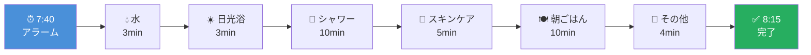

### タイムライン

```mermaid
gantt
    title 朝ルーティン タイムライン（7:40〜8:15）
    dateFormat HH:mm
    axisFormat %H:%M

    section 覚醒
    コップ一杯の水       :water, 07:40, 3m
    日光浴               :sun, after water, 3m

    section 身体ケア
    シャワー             :shower, after sun, 10m
    スキンケア           :skin, after shower, 5m

    section 栄養
    朝ごはん             :meal, after skin, 10m

    section その他
    その他               :other, after meal, 4m
```

### 時間配分（円グラフ）

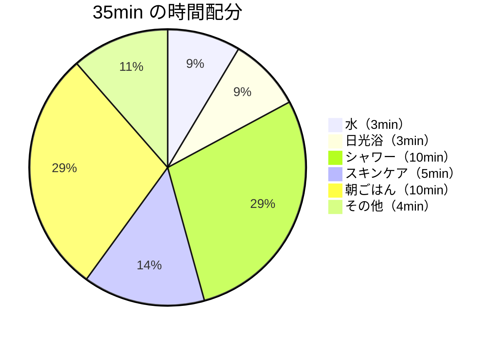

---

## 1. ルーティン一覧表

| 名前 | 効果 | 原理 | 時間 | min |
|------|------|------|------|-----|
| コップ一杯の水 | 脱水補正・脳の覚醒・腸の動きを促す | 睡眠中に失った水分を補い、血流を整えて覚醒スイッチを入れる | 7:40 → 7:43 | 3 |
| 日光浴 | 体内時計のリセット・覚醒・気分の安定 | 光が網膜から入りメラトニンを抑制し、セロトニン分泌を促す | 7:43 → 7:46 | 3 |
| シャワー | 体温上昇・覚醒・清潔感でスイッチオン | 温冷水の刺激で交感神経が優位になり、心身が活動モードになる | 7:46 → 7:56 | 10 |
| スキンケア | 肌のコンディション維持・自分へのケアの習慣化 | 朝の保湿・UVケアで日中の肌を守り、セルフケアのルーティンとして定着させる | 7:56 → 8:01 | 5 |
| 朝ごはん | 血糖安定・集中力・午前のパフォーマンスの土台 | ブドウ糖補給とタンパク質で脳と体にエネルギーを供給し、午前の生産性を高める | 8:01 → 8:11 | 10 |
| その他 | モチベーション・ストレス緩和・「朝の時間」の価値実感 | ミッション確認で目的意識を呼び覚まし、好きな1曲で気分を上げて1日をスタートする | 8:11 → 8:15 | 4 |
| **合計** | — | — | **35min** | **35** |

---

## 2. 各ルーティンの効果・原理 詳細

### 2.1 コップ一杯の水（7:40 → 7:43 / 3min）

#### 効果

| カテゴリ | 詳細 |
|----------|------|
| **脱水の補正** | 睡眠中に約 300〜500ml の水分が呼吸・発汗で失われる。起床直後の水分補給で血液粘度が下がり、全身への酸素・栄養供給が改善される。 |
| **脳の覚醒** | 軽い脱水（体重の 1〜2%）でも認知機能・注意力が低下する。水を飲むことで脳への血流が回復し、覚醒レベルが上がる。 |
| **腸の蠕動促進** | 空腹時に水が胃に入ると胃結腸反射が起き、腸の蠕動運動が促される。朝の排便リズムの形成に寄与する。 |

#### 原理

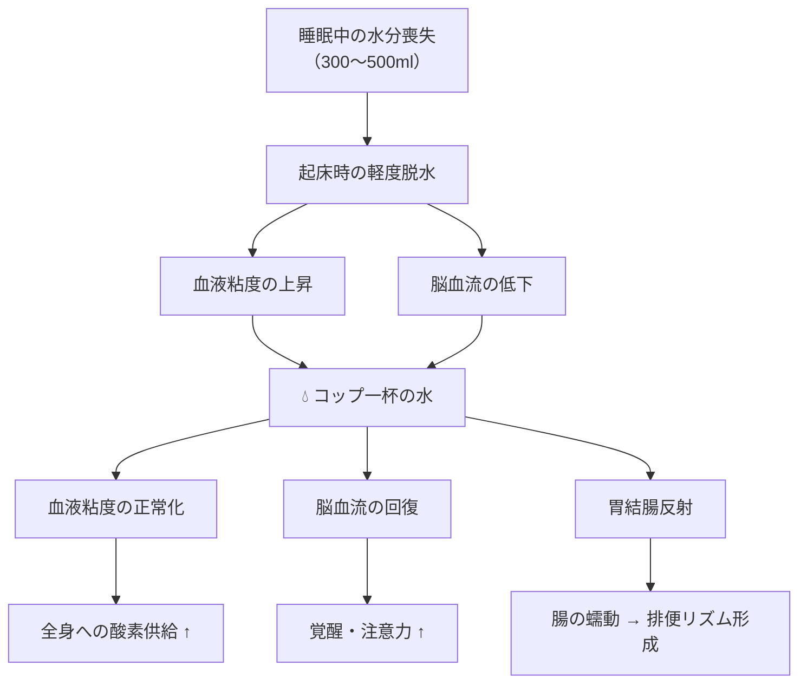

---

### 2.2 日光浴（7:43 → 7:46 / 3min）

#### 効果

| カテゴリ | 詳細 |
|----------|------|
| **体内時計のリセット** | 網膜の ipRGC（内因性光感受性ガングリオン細胞）が光を検知し、視交叉上核（SCN）に信号を送ることで、概日リズムが24時間周期にリセットされる。 |
| **覚醒の促進** | 光刺激によりメラトニン（睡眠ホルモン）の分泌が急速に抑制され、代わりにコルチゾール（覚醒ホルモン）の朝のピークが正常化する。 |
| **気分の安定** | 光はセロトニン神経系を活性化する。セロトニンは気分・感情の安定に関与し、午前中の前向きな気分の基盤になる。 |

#### 原理

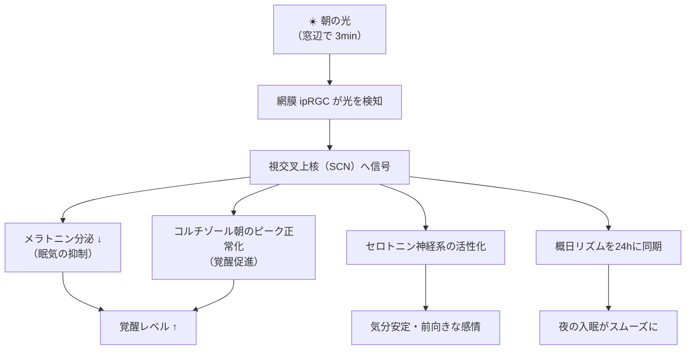

---

### 2.3 シャワー（7:46 → 7:56 / 10min）

#### 効果

| カテゴリ | 詳細 |
|----------|------|
| **深部体温の上昇** | 温水シャワーで末梢血管が拡張し血流が増加。深部体温がわずかに上昇することで、身体が「日中モード」に切り替わる。 |
| **交感神経の活性化** | 水温の刺激（特にぬるめ→やや熱めの変化）が交感神経を優位にし、心拍・血圧が適度に上がって覚醒が強まる。 |
| **清潔感による心理効果** | 「洗い流す」行為が心理的なリフレッシュになり、「1日が始まった」という区切りの感覚を生む。 |

#### 原理

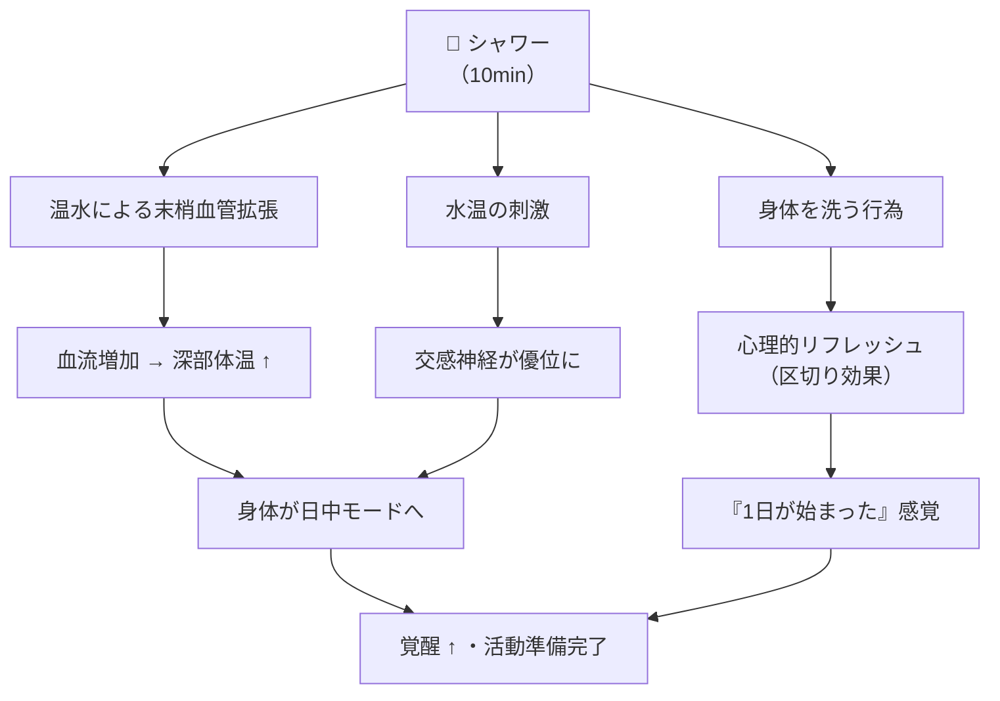

---

### 2.4 スキンケア（7:56 → 8:01 / 5min）

#### 効果

| カテゴリ | 詳細 |
|----------|------|
| **肌バリアの保護** | 洗顔後の肌は皮脂膜が薄くなり乾燥しやすい。保湿剤で角質層の水分を閉じ込め、バリア機能を維持する。 |
| **紫外線防御** | 日焼け止め（SPF）は UV-B による日焼けを、PA は UV-A による光老化を防ぐ。朝の塗布が日中の肌ダメージを大幅に軽減する。 |
| **セルフケア習慣の定着** | 自分の肌に触れ・整える行為が「自分を大切にしている」感覚を生み、自己効力感を高める。小さな成功体験として習慣化の土台になる。 |

#### 原理

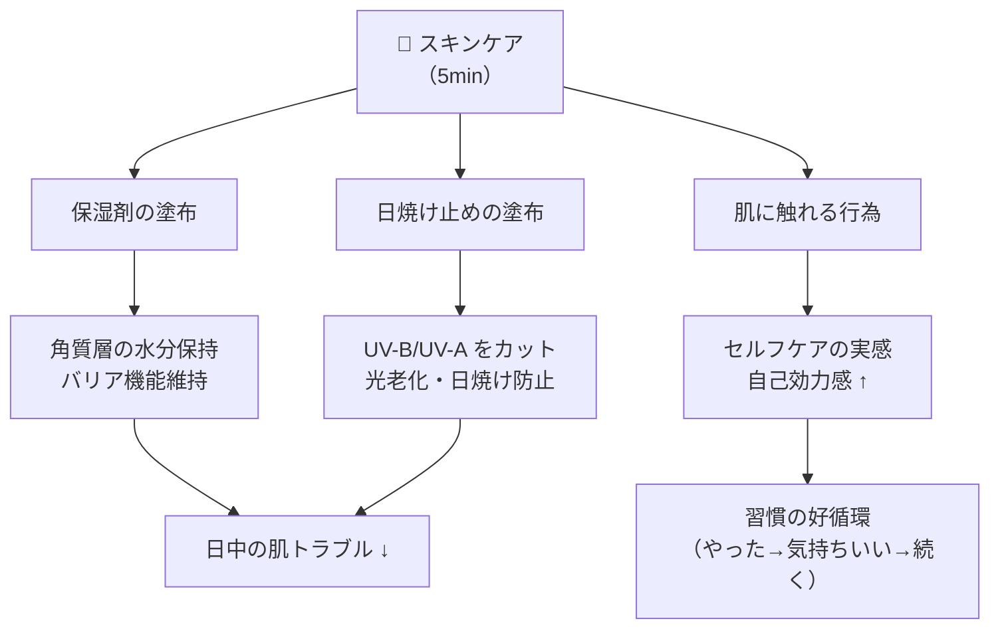

---

### 2.5 朝ごはん（8:01 → 8:11 / 10min）

#### 効果

| カテゴリ | 詳細 |
|----------|------|
| **血糖値の安定** | 空腹のまま午前を過ごすと低血糖→反動の血糖スパイクが起きやすい。朝食で緩やかにエネルギーを供給し、血糖を安定させる。 |
| **脳へのエネルギー供給** | 脳のエネルギー源は主にブドウ糖。朝食で炭水化物を摂ることで、午前中の集中力・判断力・記憶力を維持できる。 |
| **体内時計の同期（末梢時計）** | 食事は肝臓・腸などの末梢時計を動かすタイムキュー。光（中枢時計）＋食事（末梢時計）の両方で概日リズムが強化される。 |

#### 原理

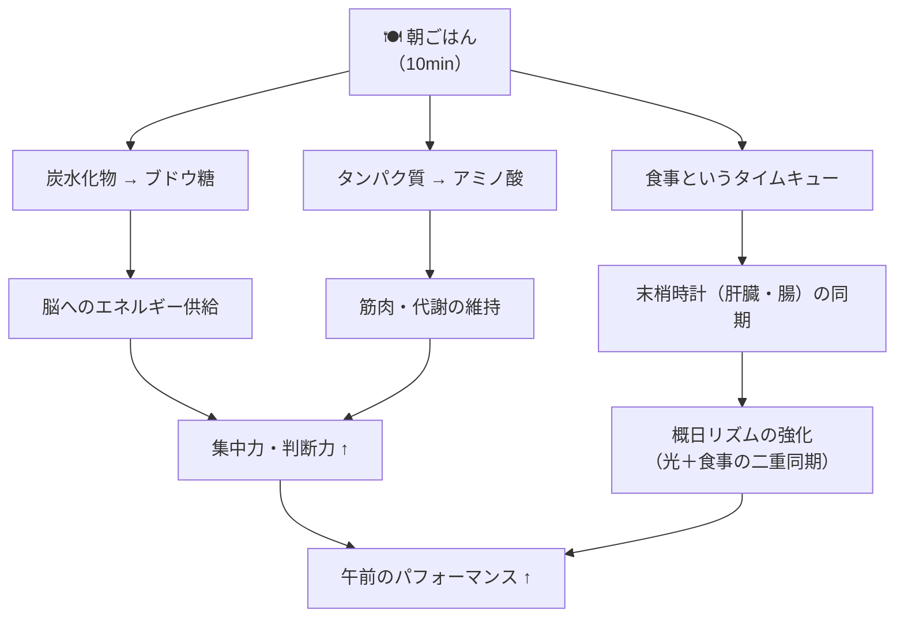

---

### 2.6 その他（8:11 → 8:15 / 4min）

> **具体的な施策**：ミッションの確認（1〜2min）＋ 好きな1曲を聴く（2〜3min）

#### 効果

| カテゴリ | 詳細 |
|----------|------|
| **モチベーション向上** | 自分のミッション・目標を朝一で目にすることで「何のために動くか」が明確になり、内発的動機づけが高まる。さらに好きな1曲が気分を引き上げ、行動のエンジンになる。 |
| **ストレス緩和** | 音楽はコルチゾール（ストレスホルモン）を低下させる効果がある。朝の時点で心理的余裕を確保しておくことで、その後の仕事や予定へのストレス耐性が上がる。 |
| **「朝の時間」の価値実感** | 「この数分があるから早起きしてよかった」という体験が積み重なることで、ルーティン全体の定着率が上がる。 |

#### 原理

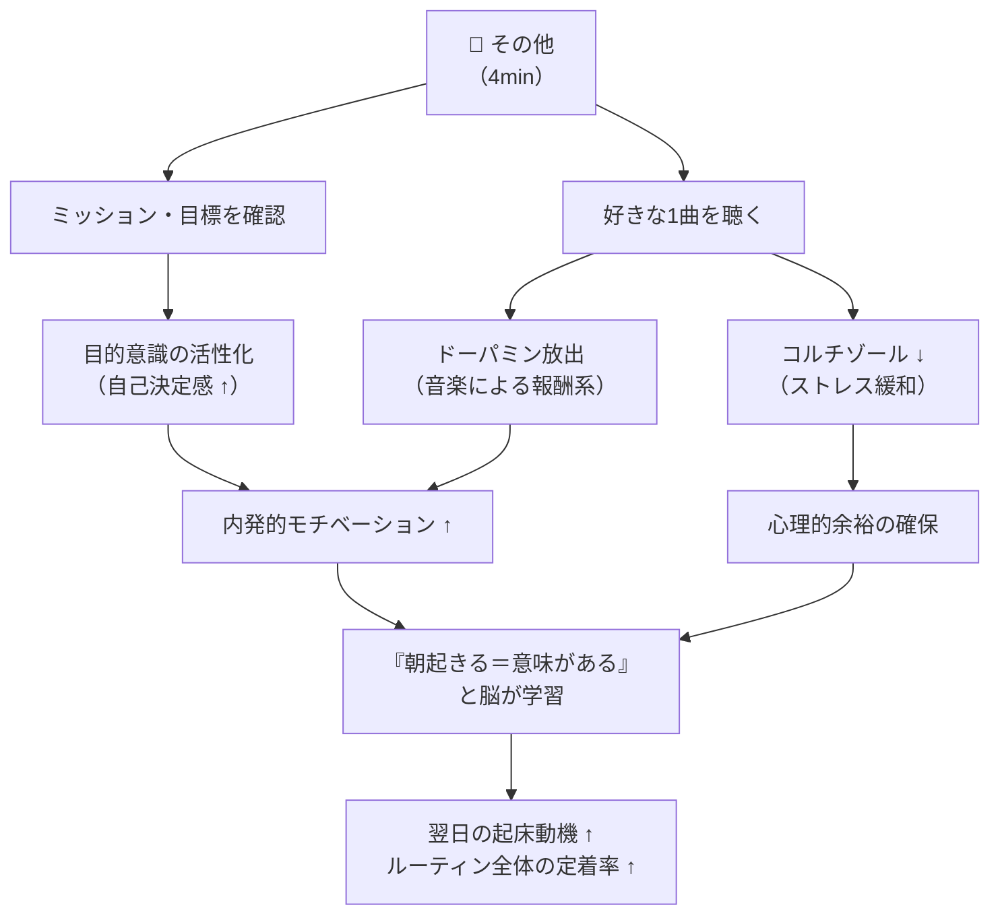

---

## 3. ルーティンの全体構造（効果マップ）

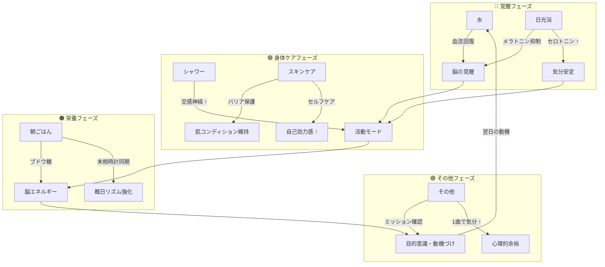

---

## 4. 導入 WBS（段階的に定着させる）

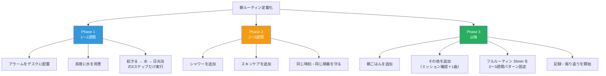

---

## 5. 定着化のための環境設計・ルール

### 5.1 早起きの土台（努力に依存しない設計）

| 項目 | 内容 |
|------|------|
| **アラームの配置** | デスクに置く。ベッドから手が届かない場所にし、「止めに行く＝自然と起き上がる」流れにする。 |
| **アラームの隣** | 前夜にコップに水を用意しておく。止めに行ったついでに飲む→「水」のトリガーと一体化。 |
| **スマホ** | 寝室外（リビング・別室）に置く。SNS・二度寝の誘惑を減らす。 |
| **就寝時間** | 7:40起きなら6〜7時間睡眠を想定し、就寝時刻を固定（例：0:40〜1:40）。 |

### 5.2 習慣のトリガー設計

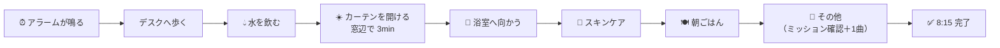

> 各ステップの**終了が次のトリガー**になる「チェーン構造」。判断ポイントを排除し、流れで動けるようにする。

### 5.3 記録・振り返り

| 項目 | 方法 |
|------|------|
| **実施の記録** | 各項目を「できた／できなかった」で記録し、Notionなどで可視化する |
| **例外ルール** | 1日崩れても翌日は通常ルーティンに戻す。完璧を求めず「戻す」ことに集中する |
| **効果・原理の参照** | 表の「効果」「原理」をときどき読み返し、「なぜやるか」を再確認する |

---

## 6. 冬・寒い時期の補足

- アラームを止めに行く経路に、**上着を1枚かけておく**。
- 起き上がった直後の冷たさを和らげ、デスクまで行くハードルを下げる。

---

## 7. プロジェクトの目標（一言）

**「意志力に頼らず、環境とトリガーで、7:40〜8:15の朝ルーティン（35min）を自動化する。」**

---

*最終更新：効果・原理の詳細＋Mermaid図を追加*
